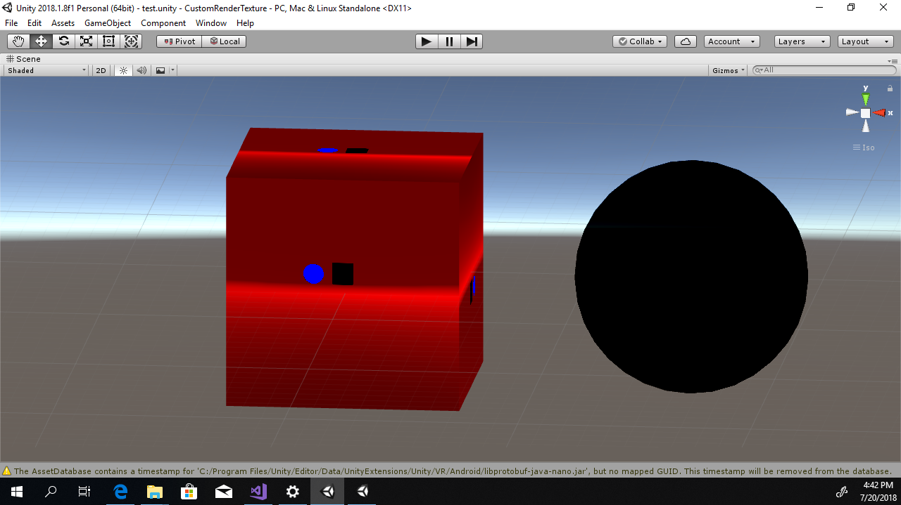

# RenderTexture Test

## Unity2018.2.3f1で、直った。

## 概要

RenderTextureをCubeに貼って表示している。

color.r < 0 を取るピクセルは青く表示されている

Unity2018.1とUnity2018.2で、挙動が違う！

## Unity2018.1.8

## Unity2018.2.0

## 対策

Unityをバージョンアップする

OnRenderImage(s,d)のsのテクスチャをコピーして使う
[https://github.com/sugi-cho/Unity-RenderTexture-Test/blob/master/Assets/RenderTexture/Scripts/Copy.cs#L26-L32](https://github.com/sugi-cho/Unity-RenderTexture-Test/blob/master/Assets/RenderTexture/Scripts/Copy.cs#L26-L32)
